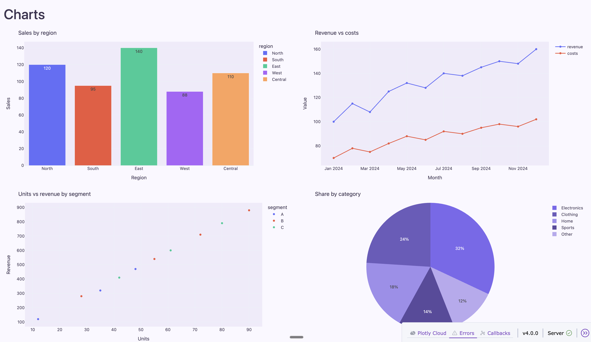
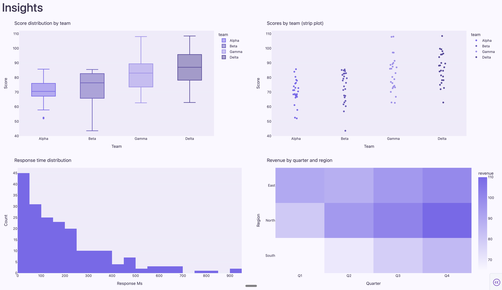

# Plotly Factory

Plotly-based dashboards and the context library that guides their development.

| Charts | Insights |
|--------|----------|
|  |  |

## Quick start

- **Install**: `pip install -r requirements.txt`  
- **Run**: `python app.py` or `dash run app:app`  
- **Sample dashboard**: From repo root, `pip install -r sample-dashboard/sample/requirements.txt` then `python run_sample.py` — see [sample-dashboard/sample/README.md](sample-dashboard/sample/README.md).  
- **Tests**: `pytest` (or `pytest tests/`)

### Using the context factory to generate Plotly visualizations (end user)

```
    ┌─────────────────────────────────┐
    │ 1. Open project in Cursor       │
    └──────────────┬──────────────────┘
                   ▼
    ┌─────────────────────────────────┐
    │ 2. Tell AI what you want        │
    └──────────────┬──────────────────┘
                   ▼
    ┌─────────────────────────────────┐
    │ 3. Point AI at docs if needed   │
    └──────────────┬──────────────────┘
                   ▼
    ┌─────────────────────────────────┐
    │ 4. Provide data or sample       │
    └──────────────┬──────────────────┘
                   ▼
    ┌─────────────────────────────────┐
    │ 5. Iterate on tweaks            │
    └──────────────┬──────────────────┘
                   ▼
    ┌─────────────────────────────────┐
    │ 6. Run & extend                 │
    └─────────────────────────────────┘
```

Follow these steps in detail:

1. **Open the project in Cursor** (or your editor with the context docs available). The docs in `docs/` and the rules in `.cursor/rules/` give the AI consistent patterns for Plotly and Dash.

2. **Tell the AI what you want** — e.g. “Plot a bar chart of sales by region from this CSV” or “Add a time series of daily active users to the dashboard.” Mention **Plotly** or **Dash** so the agent uses this stack.

3. **Point the AI at the right docs** — If the result doesn’t match your conventions, say e.g. “Follow the patterns in `docs/04-PLOTLY-GUIDE.md` and `docs/05-DASH-GUIDE.md`” or “Use the theme and layout from `docs/08-UI-ACCESSIBILITY.md`.” The numbered docs (01–11) are in recommended reading order.

4. **Provide data or a sample** — Share a small sample (e.g. CSV head, dict, or column names) so the AI can generate a real figure. If you already have a callback or layout, reference the file so outputs stay consistent with your app.

5. **Iterate** — Ask for tweaks (e.g. “Use the same color palette as in the guide,” “Add a dropdown to filter by region,” “Wrap the graph in `dcc.Loading`”). The context factory keeps style and patterns consistent across requests.

6. **Run and extend** — Run the app (see Install/Run above). For new pages or components, refer the AI to [docs/03-ARCHITECTURE.md](docs/03-ARCHITECTURE.md) and [docs/07-COMPONENTS.md](docs/07-COMPONENTS.md) so structure and reuse stay aligned.

**Tip**: Keep `AGENTS.md` and the `docs/` folder in the project; the AI uses them to align output with this context factory. For a full workflow from scratch to deployment, see [Using this context factory effectively](#using-this-context-factory-effectively) below.

## Context library

Before building or changing dashboards, read the docs in **`docs/`**:

| Doc | Purpose |
|-----|--------|
| [01 Plan](docs/01-CONTEXT-LIBRARY-PLAN.md) | Context library plan and file list |
| [02 Conventions](docs/02-CONVENTIONS.md) | Naming, layout, style |
| [03 Architecture](docs/03-ARCHITECTURE.md) | Layout, callbacks, routing, related/unrelated apps |
| [04 Plotly guide](docs/04-PLOTLY-GUIDE.md) | Plotly APIs, charts, theming |
| [05 Dash guide](docs/05-DASH-GUIDE.md) | Dash components, callbacks |
| [06 Data patterns](docs/06-DATA-PATTERNS.md) | Data loading, caching |
| [07 Components](docs/07-COMPONENTS.md) | Reusable charts and controls |
| [08 UI & accessibility](docs/08-UI-ACCESSIBILITY.md) | A11y and styling |
| [09 Contributing](docs/09-CONTRIBUTING.md) | How to add dashboards and update the library |
| [10 Troubleshooting](docs/10-TROUBLESHOOTING.md) | Common errors and fixes |
| [11 Deployment](docs/11-DEPLOYMENT.md) | Dev vs prod, Docker, env |

Read in order **01 → 02 → 03 → …** as needed during development. The full plan is in [docs/01-CONTEXT-LIBRARY-PLAN.md](docs/01-CONTEXT-LIBRARY-PLAN.md).

### Updating the context library (docs)

When you add or change patterns or docs that are part of the context library:

| Change | Where | Also update |
|--------|--------|-------------|
| **New pattern** (data, callbacks, Plotly, UI, etc.) | Put it in the most relevant doc: [docs/06-DATA-PATTERNS.md](docs/06-DATA-PATTERNS.md), [docs/05-DASH-GUIDE.md](docs/05-DASH-GUIDE.md), [docs/04-PLOTLY-GUIDE.md](docs/04-PLOTLY-GUIDE.md), [docs/08-UI-ACCESSIBILITY.md](docs/08-UI-ACCESSIBILITY.md). If it’s a must-follow, add a short note in [docs/02-CONVENTIONS.md](docs/02-CONVENTIONS.md) or [AGENTS.md](AGENTS.md). | — |
| **New doc** | Add a new `docs/*.md` only when the topic doesn’t fit existing docs. | Update [docs/01-CONTEXT-LIBRARY-PLAN.md](docs/01-CONTEXT-LIBRARY-PLAN.md) and this README (Context library table) and [AGENTS.md](AGENTS.md) so the new doc is listed and linked. |
| **Cursor rules** | When you add file patterns or change conventions. | Update `.cursor/rules/*.mdc` so the AI still points to the right docs. |

---

## Using this context factory effectively

This section describes how to use the context library to go **from scratch to a full setup** and to deliver **visually aesthetic dashboards with a high degree of user experience (UX)**. Follow the workflow below and apply the aesthetics and UX guidelines ([docs/08-UI-ACCESSIBILITY.md](docs/08-UI-ACCESSIBILITY.md)) every step of the way.

### From scratch to entire setup

**1. Orient and agree on structure**

- Read [docs/02-CONVENTIONS.md](docs/02-CONVENTIONS.md) first so you know the stack, app structure, naming, and layout.
- Decide whether you have a single-page app or multi-page; document it in [docs/03-ARCHITECTURE.md](docs/03-ARCHITECTURE.md) (layout, routing, where callbacks live).
- If starting from zero, add a minimal `app.py` (or entry module), an `assets/` folder, and any `pages/` or `components/` layout that matches CONVENTIONS.

**2. Define architecture and patterns**

- Describe layout (navbar, main content area, sidebar if any) and the main callback flows in [docs/03-ARCHITECTURE.md](docs/03-ARCHITECTURE.md).
- Define how data is loaded, transformed, and cached in [docs/06-DATA-PATTERNS.md](docs/06-DATA-PATTERNS.md) so every dashboard uses the same patterns and stays consistent.
- Choose a theme and chart defaults once; document them in [docs/04-PLOTLY-GUIDE.md](docs/04-PLOTLY-GUIDE.md) and [docs/08-UI-ACCESSIBILITY.md](docs/08-UI-ACCESSIBILITY.md).

**3. Build with the docs and components**

- Use [docs/05-DASH-GUIDE.md](docs/05-DASH-GUIDE.md) for callbacks (Input/Output/State, `prevent_initial_call`, `no_update`) and [docs/04-PLOTLY-GUIDE.md](docs/04-PLOTLY-GUIDE.md) for figures.
- Prefer reusable building blocks from [docs/07-COMPONENTS.md](docs/07-COMPONENTS.md); when you create a new one, add it there so future work stays consistent.
- Keep IDs and naming aligned with [docs/02-CONVENTIONS.md](docs/02-CONVENTIONS.md) to avoid callback bugs and confusion.

**4. Wire in Cursor (and AI) for consistency**

- Rely on `.cursor/rules/` so that when you (or an agent) edit Python or `assets/`, the rules point to the right docs. Keep rules and docs in sync when you add new patterns or file paths.
- Use [AGENTS.md](AGENTS.md) as the single place for “what this project is” and “where to read” so any AI-assisted session starts from the same context.

**5. Harden and ship**

- Run your app, tests, and lint; document commands in README and [AGENTS.md](AGENTS.md).
- Fill [docs/11-DEPLOYMENT.md](docs/11-DEPLOYMENT.md) for dev vs prod, and use [docs/10-TROUBLESHOOTING.md](docs/10-TROUBLESHOOTING.md) for recurring issues so the next person (or agent) can fix them quickly.
- Before release, run the [checklist before you ship](docs/09-CONTRIBUTING.md#4-checklist-before-you-ship) in [docs/09-CONTRIBUTING.md](docs/09-CONTRIBUTING.md).

---

## Project structure

Layout follows [docs/02-CONVENTIONS.md](docs/02-CONVENTIONS.md) and [docs/03-ARCHITECTURE.md](docs/03-ARCHITECTURE.md): main app at root, related pages in `pages/`, unrelated apps in `apps/`, shared code in `shared/`.

```
├── README.md
├── AGENTS.md
├── app.py                    # Main app entry (related dashboards)
├── requirements.txt
├── pages/                     # Related dashboard pages (same app)
│   └── <name>.py
├── assets/                    # CSS, JS, images (shared by main app)
├── components/                # Reusable UI (charts, filters, layout)
├── data/                      # Data loaders, caching
├── utils/                     # Helpers, config
├── apps/                      # Unrelated dashboards (each deployable separately)
│   └── <dashboard_name>/
│       ├── app.py
│       ├── pages/
│       └── assets/
├── shared/                    # Optional: code shared across apps/
│   ├── components/
│   ├── data/
│   └── theme/
├── docs/                      # Context library (01–11)
│   ├── 01-CONTEXT-LIBRARY-PLAN.md
│   └── ...
├── sample-dashboard/          # Sample dashboard (reference implementation)
│   └── sample/
│       ├── app.py
│       ├── pages/, components/, data/, assets/, utils/
│       └── README.md
├── run_sample.py             # Launcher for sample dashboard
└── .cursor/
    └── rules/                 # Plotly/Dash and assets rules
        ├── plotly-dashboards.mdc
        └── dashboard-assets.mdc
```

## License

This project is **open source** and **free to use**. You may use, modify, and distribute it for any purpose.

If it helped you, consider giving the repo a **star** or a shout-out on **LinkedIn** — recognition is always appreciated.
